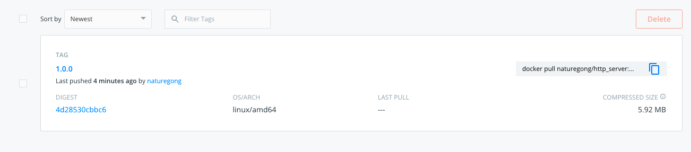

# HW2

## 题目

```
构建本地镜像
编写 Dockerfile 将练习 2.2 编写的 httpserver 容器化
将镜像推送至 docker 官方镜像仓库
通过 docker 命令本地启动 httpserver
通过 nsenter 进入容器查看 IP 配置
```

## 执行

### 1.构建镜像
```shell
make image
```

### 2.查看当前构建的镜像
```shell
docker image ls | grep http_server
```

### 3.将镜像推送至 docker 官方镜像仓库
```shell
make push
```


### 4.启动容器
```shell
docker run -it -d --name http_server -p 8080:8080 naturegong/http_server:1.0.0
```

### 5.通过nsenter进入容器查看IP配置

查看容器PID
```shell
docker inspect --format '{{ .State.Pid }}' http_server
```
查看容器IP配置
```shell
nsenter -t $(docker inspect --format '{{ .State.Pid }}' http_server) -n ip addr show
```
```shell
1: lo: <LOOPBACK,UP,LOWER_UP> mtu 65536 qdisc noqueue state UNKNOWN group default qlen 1000
  link/loopback 00:00:00:00:00:00 brd 00:00:00:00:00:00
  inet 127.0.0.1/8 scope host lo
     valid_lft forever preferred_lft forever
26: eth0@if27: <BROADCAST,MULTICAST,UP,LOWER_UP> mtu 1500 qdisc noqueue state UP group default
link/ether 02:42:ac:11:00:02 brd ff:ff:ff:ff:ff:ff link-netnsid 0
inet 172.17.0.2/16 brd 172.17.255.255 scope global eth0
valid_lft forever preferred_lft forever
```

### 6.关闭容器
```shell
docker stop http_server
```
