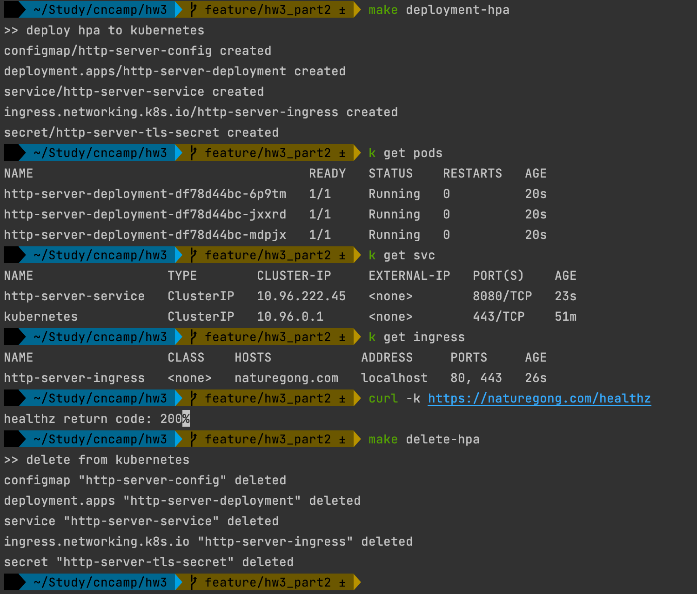

# HW3

## 题目-第一部分

```
1. 第一部分
现在你对 Kubernetes 的控制面板的工作机制是否有了深入的了解呢？
是否对如何构建一个优雅的云上应用有了深刻的认识，那么接下来用最近学过的知识把你之前编写的 http 以优雅的方式部署起来吧，你可能需要审视之前代码是否能满足优雅上云的需求。
作业要求：编写 Kubernetes 部署脚本将 httpserver 部署到 Kubernetes 集群，以下是你可以思考的维度。

优雅启动
优雅终止
资源需求和 QoS 保证
探活
日常运维需求，日志等级
配置和代码分离
```

## 修改
### 内容
- 优化代码结构
- 增加优雅启动
- 增加优雅终止
- 配置资源需求和QoS保证
- 配置探活
- 配置与代码分离，增加config.yaml用于配置，通过config.map挂载在config目录
- 使用zap作为日志框架，可通过配置文件配置和修改日志等级
- 通过NodePort的方式部署Service

## 执行
### 构建镜像
```shell
make push
```

### 部署
```shell
make deploy
```

获取部署的Pod状态
```shell
kubectl get pods

NAME                          READY   STATUS    RESTARTS   AGE
http-server-89b75fd59-5qcml   1/1     Running   0          92s
http-server-89b75fd59-7hsz7   1/1     Running   0          92s
http-server-89b75fd59-qvbm8   1/1     Running   0          92s
```

获取部署的ConfigMap内容
```shell
kubectl get configmaps/http-server-config -oyaml

apiVersion: v1
data:
  config: |
    Env: dev
    Http: 8080
    Log:
      Path: ./logs
      Level: DEBUG
kind: ConfigMap
metadata:
  annotations:
    kubectl.kubernetes.io/last-applied-configuration: |
      {"apiVersion":"v1","data":{"config":"Env: dev\nHttp: 8080\nLog:\n  Path: ./logs\n  Level: DEBUG\n"},"kind":"ConfigMap","metadata":{"annotations":{},"name":"http-server-config","namespace":"default"}}
  creationTimestamp: "2022-06-12T15:41:53Z"
  name: http-server-config
  namespace: default
  resourceVersion: "16375"
  uid: e2d3e0ef-5365-4908-8b02-d7d825558ea8
```

获取部署的Service状态
```shell
kubectl get svc

NAME                  TYPE        CLUSTER-IP      EXTERNAL-IP   PORT(S)          AGE
http-server-service   NodePort    10.96.141.132   <none>        8080:30086/TCP   59s
```

获取其中一个部署pod
```shell
kubectl describe po http-server-89b75fd59-5qcml

Name:         http-server-89b75fd59-5qcml
Namespace:    default
Priority:     0
Node:         nature-cluster-worker/172.20.0.3
Start Time:   Sun, 12 Jun 2022 23:41:53 +0800
Labels:       app=http-server
              pod-template-hash=89b75fd59
Annotations:  prometheus.io/port: 8080
              prometheus.io/scrape: true
Status:       Running
IP:           10.244.1.18
IPs:
  IP:           10.244.1.18
Controlled By:  ReplicaSet/http-server-89b75fd59
Containers:
  http-server:
    Container ID:   containerd://25b14af48fefe89f0e574e6bdc462001bf6c13dd41c76de6d6d27b571753e536
    Image:          naturegong/http_server
    Image ID:       docker.io/naturegong/http_server@sha256:e91200ab5451b31d5a78d76d35c7afc2a33cf4e0467c7c11c7e4ea9562f43818
    Port:           8080/TCP
    Host Port:      0/TCP
    State:          Running
      Started:      Sun, 12 Jun 2022 23:42:01 +0800
    Ready:          True
    Restart Count:  0
    Limits:
      cpu:     100m
      memory:  100Mi
    Requests:
      cpu:      100m
      memory:   50Mi
    Liveness:   http-get http://:8080/healthz delay=10s timeout=1s period=30s #success=1 #failure=3
    Readiness:  http-get http://:8080/healthz delay=2s timeout=1s period=5s #success=1 #failure=3
    Environment Variables from:
      http-server-config  ConfigMap  Optional: false
    Environment:          <none>
    Mounts:
      /logs from log-storage (rw)
      /var/run/secrets/kubernetes.io/serviceaccount from kube-api-access-qzqqn (ro)
Conditions:
  Type              Status
  Initialized       True
  Ready             True
  ContainersReady   True
  PodScheduled      True
Volumes:
  log-storage:
    Type:       EmptyDir (a temporary directory that shares a pod's lifetime)
    Medium:
    SizeLimit:  40Mi
  kube-api-access-qzqqn:
    Type:                    Projected (a volume that contains injected data from multiple sources)
    TokenExpirationSeconds:  3607
    ConfigMapName:           kube-root-ca.crt
    ConfigMapOptional:       <nil>
    DownwardAPI:             true
QoS Class:                   Burstable
Node-Selectors:              <none>
Tolerations:                 node.kubernetes.io/not-ready:NoExecute op=Exists for 300s
                             node.kubernetes.io/unreachable:NoExecute op=Exists for 300s
Events:
  Type    Reason     Age   From               Message
  ----    ------     ----  ----               -------
  Normal  Scheduled  15s   default-scheduler  Successfully assigned default/http-server-89b75fd59-5qcml to nature-cluster-worker
  Normal  Pulling    14s   kubelet            Pulling image "naturegong/http_server"
  Normal  Pulled     7s    kubelet            Successfully pulled image "naturegong/http_server" in 6.327350753s
  Normal  Created    7s    kubelet            Created container http-server
  Normal  Started    7s    kubelet            Started container http-server
```

### 删除
```shell
make delete
```

## 题目-第二部分
```
模块八作业第二部分
除了将 httpServer 应用优雅的运行在 Kubernetes 之上，我们还应该考虑如何将服务发布给对内和对外的调用方。
来尝试用 Service, Ingress 将你的服务发布给集群外部的调用方吧。
在第一部分的基础上提供更加完备的部署 spec，包括（不限于）：

Service
Ingress
可以考虑的细节

如何确保整个应用的高可用。
如何通过证书保证 httpServer 的通讯安全。
```

## 修改
### 内容
- 优化代码结构 
- Service 
- Ingress 
- 高可用
- 通过证书保证httpServer的通讯安全

## 执行
### 生成证书和key
1. 生成TLS证书
```shell
openssl req -x509 -nodes -days 365 -newkey rsa:2048 -keyout ./cert/ca.key -out ./cert/ca.crt -subj "/CN=naturegong.com/O=naturegong.com"
```
输出
```shell
Generating a 2048 bit RSA private key
.................+++
......................................................+++
writing new private key to 'ca.key'
-----
```
2. 创建集群的secret
```shell
kubectl create secret tls http-server-tls-secret --key ./cert/ca.key --cert ./cert/ca.crt
```
输出：
```shell
secret/http-server-tls-secret created
```
3. 查看新建TLS证书配置：
```shell
kubectl get secret
```
输出：
```shell
NAME                     TYPE                DATA   AGE
http-server-tls-secret   kubernetes.io/tls   2      23m
```

### 在ingress.yaml中增加生成Secret配置，用于配置访问证书
详细见`/deploy/k8s/ingress.yaml`

### 在ingress.yaml中增加生成Ingress配置
详细见`/deploy/k8s/ingress.yaml`

### 修改Service中的NodePort为ClusterIP
详细见`/deploy/k8s/ingress.yaml`
```shell
NAME                  TYPE        CLUSTER-IP     EXTERNAL-IP   PORT(S)    AGE
http-server-service   ClusterIP   10.96.116.52   <none>        8080/TCP   5s
```
### 修改本机/etc/hosts文件
```shell
127.0.0.1 naturegong.com
```

### 测试通过域名进行访问服务
```shell
 curl -k https://naturegong.com/healthz
```
结果：


### 把所有k8s操作放在一个workload.yaml中，并修改Makefile
详细见`/deploy/k8s/workload.yaml`和`Makefile`

创建所有配置：
```shell
make deployment-hpa
```

删除所有配置：
```shell
make delete-hpa
```

结果：



