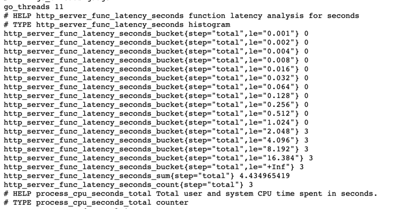
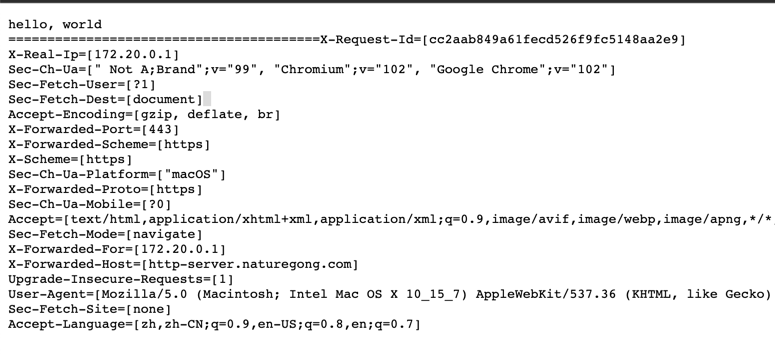
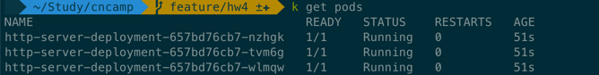
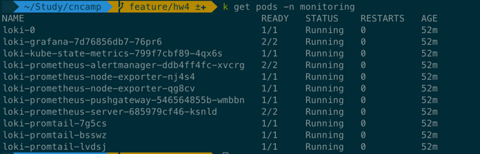
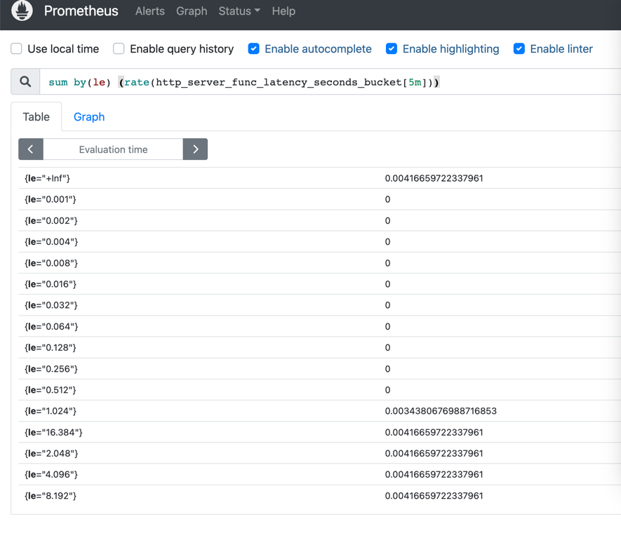
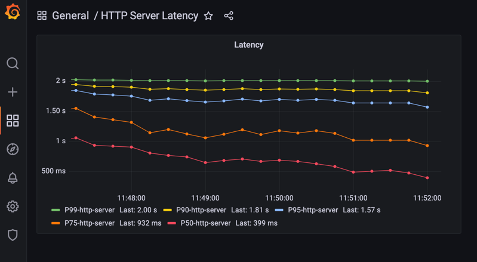

# HW4

```
为 HTTPServer 添加 0-2 秒的随机延时；
为 HTTPServer 项目添加延时 Metric；
将 HTTPServer 部署至测试集群，并完成 Prometheus 配置；
从 Promethus 界面中查询延时指标数据；
（可选）创建一个 Grafana Dashboard 展现延时分配情况。
```


## 执行
### 接口
增加指标导出相关代码，main.go中增加指标注册。
指标接口`/metrics`

请求延时接口`/hello`


将 HTTPServer 部署至测试集群，并完成 Prometheus 配置



### 指标
从Promethus界面查询延时指标数据


创建一个Grafana Dashboard展现延时分配情况



