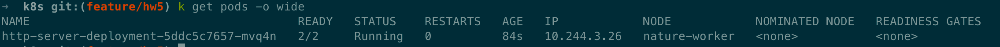
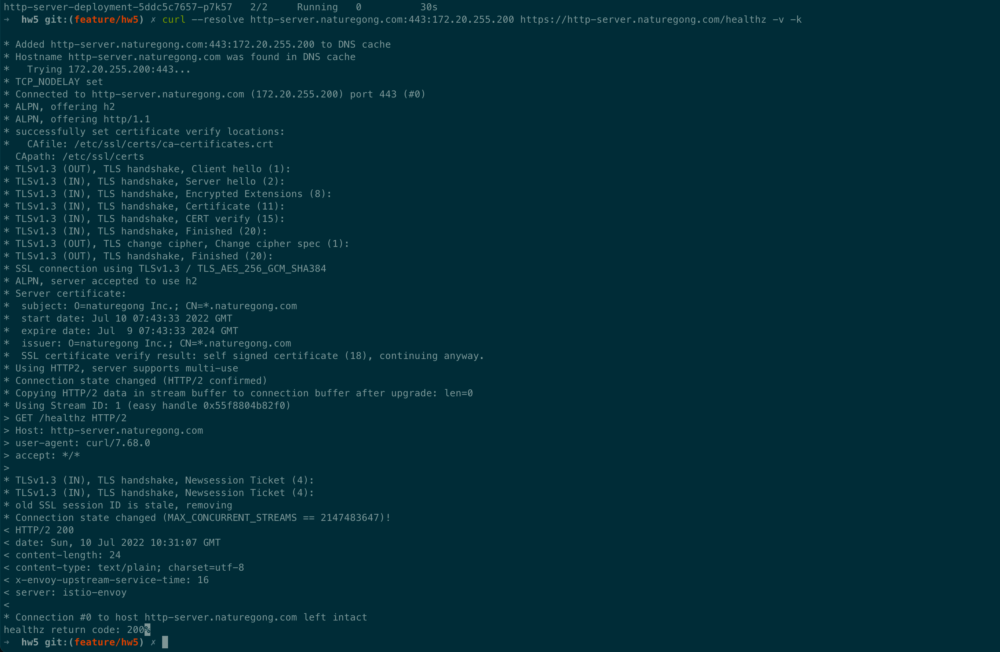

# HW5

```
把我们的 httpserver 服务以 Istio Ingress Gateway 的形式发布出来。以下是你需要考虑的几点：

如何实现安全保证；
七层路由规则；
考虑 open tracing 的接入。
```

[x] Use Istio Ingress Gateway
[x] Support HTTPS access
[x] Support L7 routing 
[x] Add Tracing

## 执行
### 下载 Istio
``` 
curl -L https://istio.io/downloadIstio | sh -
cd istio-1.14.1
sudo cp bin/istioctl /usr/local/bin
istioctl install --set profile=demo -y
```

### 安装 Istio
```shell
# 集群安装
istioctl install --set profile=demo -y

# 给命名空间添加标签，指示 Istio 在部署应用的时候，自动注入 Envoy 边车代理
kubectl label namespace default istio-injection=enabled
```

### 生成证书
```shell

openssl req -x509 -sha256 -nodes -days 365 -newkey rsa:2048 -subj '/O=naturegong Inc./CN=*.naturegong.com' -keyout naturegong.com.key -out naturegong.com.crt
kubectl create -n istio-system secret tls naturegong-credential --key=./cert/naturegong.com.key --cert=./cert/naturegong.com.crt
```

### 部署应用
```shell
make deploy-hpa
```


### 部署Istio Gateway
```shell
k apply -f  deploy/k8s/istio-spec.yaml
```



### Tracing
安装jaeger tracing
```shell
kubectl apply -f deploy/k8s/jaeger-spec.yaml
kubectl edit configmap istio -n istio-system
```

访问jaeger Dashboard，查看Tracing信息
```shell
istioctl dashboard jaeger  --address 0.0.0.0
```


